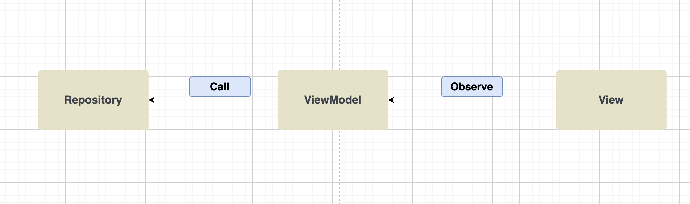
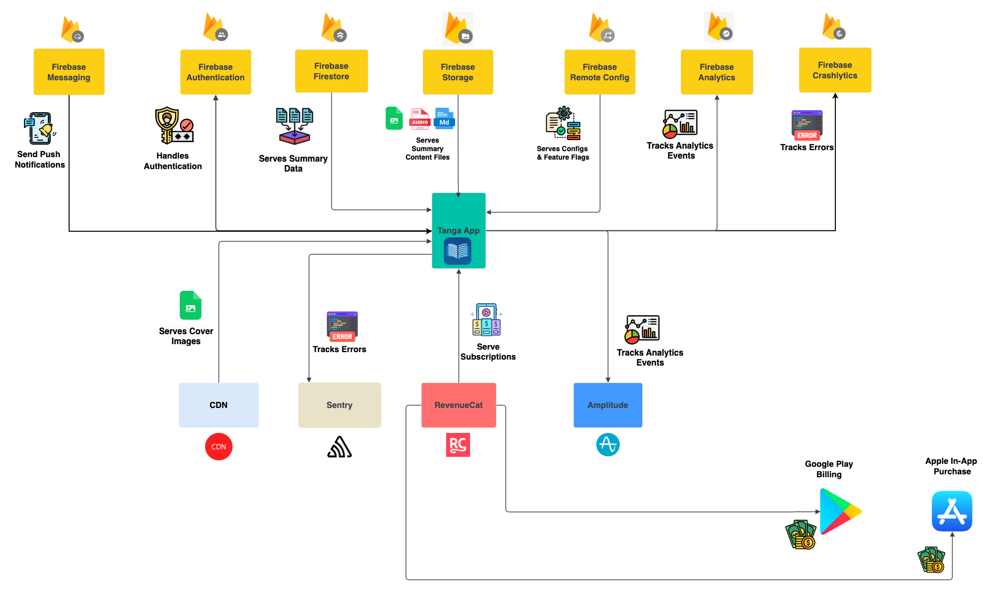

#  Tanga iOS App
🤖 See Android version here: https://github.com/rygelouv/Tanga 

---

<p align="center">
  <a href="https://sonarcloud.io/api/project_badges/measure?project=rygelouv_Tanga-iOS"></a>
  <a href="https://github.com/rygelouv/Tanga-iOS/actions" ></a>
</p>

---


---

<p align="center">
  <a href="https://sonarcloud.io/summary/new_code?id=rygelouv_Tanga-iOS"></a>
  <a href="https://tanga.app/"></a>
</p>

---

## **We are 90% complete on the MVP** 🚀🚀
Here is our latest major additions:

* Tanga Account Deletion by @rygelouv in https://github.com/rygelouv/Tanga-iOS/pull/17
* Implemented support for Push Notifications by @rygelouv in https://github.com/rygelouv/Tanga-iOS/pull/15
* Implemented Apple Sign in by @rygelouv in https://github.com/rygelouv/Tanga-iOS/pull/11
* Added RevenueCat and implement support for subscription purchases by @rygelouv in https://github.com/rygelouv/Tanga-iOS/pull/9
* Build summary Audio Player by @rygelouv in https://github.com/rygelouv/Tanga-iOS/pull/7

The other projects can be found here:
- [Tanga Projects](https://github.com/rygelouv?tab=projects)

### What is remaining for the MVP?
* Implement Protected Actions (i.e listen to summary audio without a subscription or without an account)
* Add analytics tracker
* Enable Weekly summary
* Improve Error tracking

## Setup

This project uses **pre-commit Git hooks** to enforce code quality.

### **📌 One-time Setup**
Before your first build, run:

```sh
mkdir -p ~/Library/Developer/Xcode/UserScripts/
cp scripts/check-hooks.sh ~/Library/Developer/Xcode/UserScripts/
chmod +x ~/Library/Developer/Xcode/UserScripts/check-hooks.sh
```

### **📌Swiftlint setup**
The setup above is needed for linting setup. It is broadly explained in this article: https://medium.com/@rygel/swiftlint-on-autopilot-in-xcode-enforce-code-conventions-with-git-pre-commit-hooks-and-automation-52c5eb4d5454

## Code organization
Tanga follows an MVVM architectural pattern in the implementation of most features. We use an observable ViewModel that emits variations of state elements. We also use a repository pattern on the 
data layer to access firebase firestore resources.
Note: some decision and aspect of the code and implementations could look a bit strange to pure iOS engineers because the main developer working on Tanga (me Rygel) has strong Kotlin/Android background. Feel free to prvovide feedback



## Infrastructure 
Tanga relies almost entirely on Firebase for its infrastructure. We use Firebase for:
- Authentication
- Firestore Database
- Analytics
- Crashlytics Error Tracking
- Remote Config for feature flags
- Performance Monitoring
- Messaging for push notifications
- Storage for images and other files such as audio and graphics

We also use Sentry for extra error tracking and monitoring (not added yet). We use RevenueCat for in-app purchases and subscriptions.



### Automation Infrastructure  work
We have left out many things since we are focusing on the MVP and getting the app out on the store to keep up wiht Android on a product standpoint.
- [ ] Add Unit tests
- [ ] Add full iOS build on Github Action workflow
- [ ] Add SwiftLint and/or other static code analysic tool
- [ ] Add SonarCloud
- [ ] Add dependabot
- [ ] Add Codecov for test coverage tracking - minor
- [ ] Add git hooks that run linting on each commit/push

## License
```xml
MIT License

Copyright (c) 2025 Rygel Louv

Permission is hereby granted, free of charge, to any person obtaining a copy
of this software and associated documentation files (the "Software"), to deal
in the Software without restriction, including without limitation the rights
to use, copy, modify, merge, publish, distribute, sublicense, and/or sell
copies of the Software, and to permit persons to whom the Software is
furnished to do so, subject to the following conditions:

The above copyright notice and this permission notice shall be included in all
copies or substantial portions of the Software.

THE SOFTWARE IS PROVIDED "AS IS", WITHOUT WARRANTY OF ANY KIND, EXPRESS OR
IMPLIED, INCLUDING BUT NOT LIMITED TO THE WARRANTIES OF MERCHANTABILITY,
FITNESS FOR A PARTICULAR PURPOSE AND NONINFRINGEMENT. IN NO EVENT SHALL THE
AUTHORS OR COPYRIGHT HOLDERS BE LIABLE FOR ANY CLAIM, DAMAGES OR OTHER
LIABILITY, WHETHER IN AN ACTION OF CONTRACT, TORT OR OTHERWISE, ARISING FROM,
OUT OF OR IN CONNECTION WITH THE SOFTWARE OR THE USE OR OTHER DEALINGS IN THE
SOFTWARE.
```

